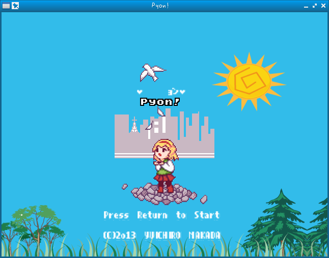

# Pyon!

a game using catcake




## How to use

```bash
$ clang++ -o pyon pyon.cpp -Iinclude -Llib.x86_64 -lcatcake -lasound -lmad -lfreetype -lpng -ljpeg -lz -lGL -lpthread -lX11 -lXxf86vm
$ ./pyon
```
